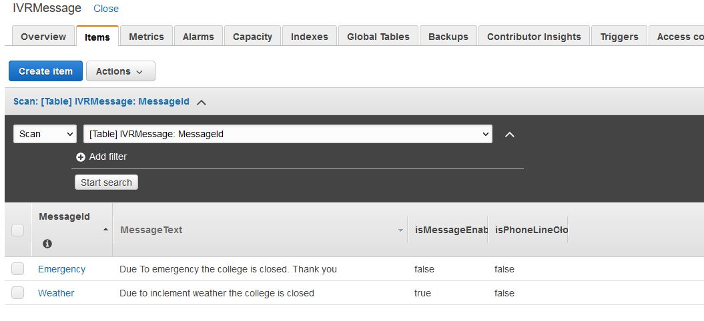
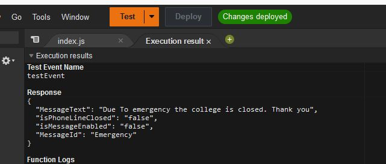
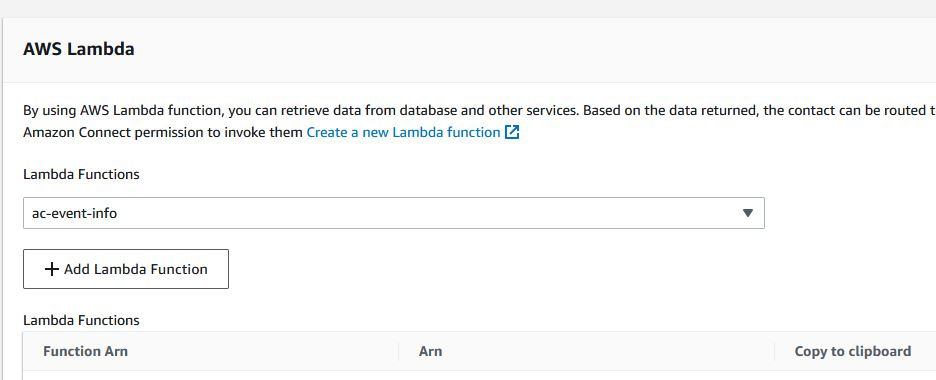
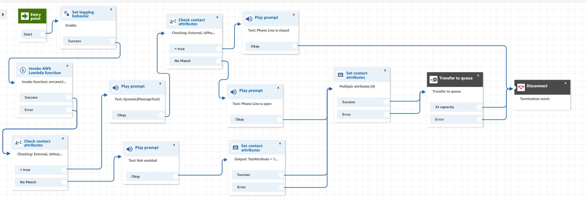

#create-centralized-announcement-message-with-amazon-connect

**Introduction**
Organization needs the capability to create centralized configurable process to add or update emergency message or announcements. Sometimes, depending on the situation, the organization needs to close the contact center. This post walks through how to maintain centralize IVR message in Dynamo DB along with configuring, if the message is enabled and if the phone line open.

**Solution overview**
Invoke the Lambda function within the contact flow and pass the Message Id e.g. “Emergency”. The Lambda would respond with the message text, is the message is enabled, is the phone line open. Based on the Lambda response, the contact flow executes the logic.

**Try it!**
1.	Create a Dynamo DB Table with name “ IVRMessage” and add the following Attributes:
- MessageId (String) – Primary partition key
- MessageText (String)
- isMessageEnabled (String)
- isPhoneLineClosed (String)
    
2.	Create a Lambda function to read the IVR Message form the above Dynamo DB table “IVRMessage”. Copy the code from the “LambdaResource” folder and put into the Lambda function. 
3.	Attach the Dynamo DB Read Only policy to the Lambda Function Role.
4.	Make sure the Lambda function is able to get the response for the Dynamo DB for a given MessageId
    
5.	Attach the Lambda function to the Amazon Connect instance.
    
6.	Import the “AC-Announcement-Message” contact flow in the contact-flow directory into your Amazon Connect instance.
    
7.	Associate the Lambda function in your contact flow inside the “Invoke AWS Lambda function” block.
8.	Publish the contact flow.

**Test**
1.	Associate the contact flow with a phone number and place a test call
2.	Change the Message text in the Dynamo DB “IVRMessgae” table
3.	Also, toggle the isMessageEnabled and isPhoneLineClose and place test call.

## Security

See [CONTRIBUTING](CONTRIBUTING.md#security-issue-notifications) for more information.

## License

This library is licensed under the MIT-0 License. See the LICENSE file.

